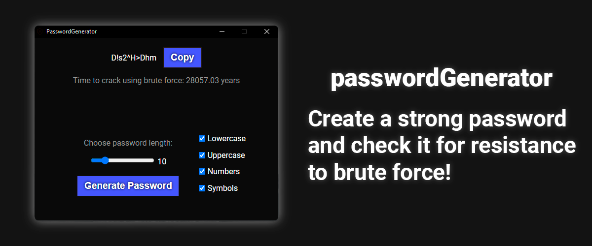

## About

Generates passwords from the specified characters and length.  
Also checks the password for resistance to brute force.
#### How it works?
- Let's imagine that a hacker knows the length of your password and what characters it may consist of.
- Ryzen 5 5600x (as the most popular processor at the moment) was used to calculate the password brute-force power
- Permutations with repetitions = (charsetLength ** passwordLength)

##### Then time to brute force the password = Permutations with repetitions / cpuCombinationsPerSec

## Usage
Just run, choose the length and characters, and generate!

## Developers

- [vierhundertundvierzigahcaptain](https://github.com/vierhundertundvierzigahcaptain)
